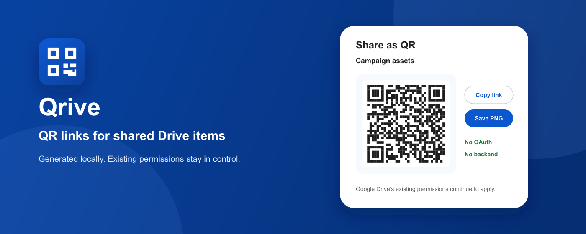
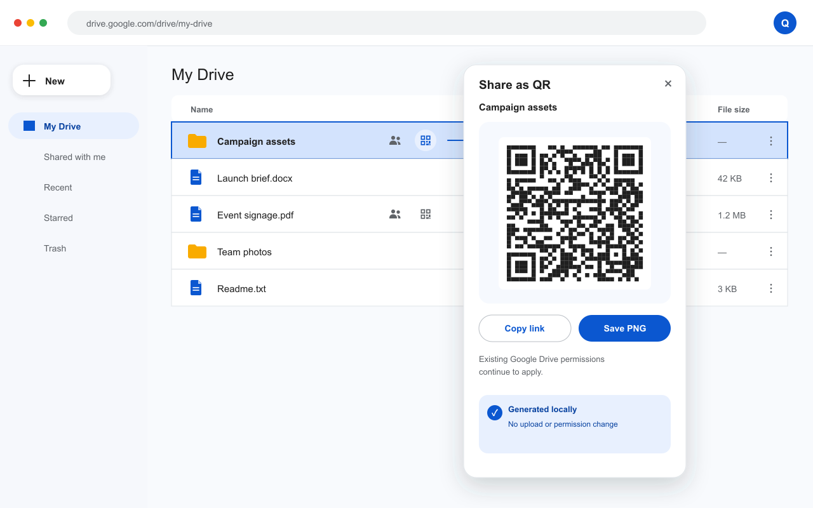
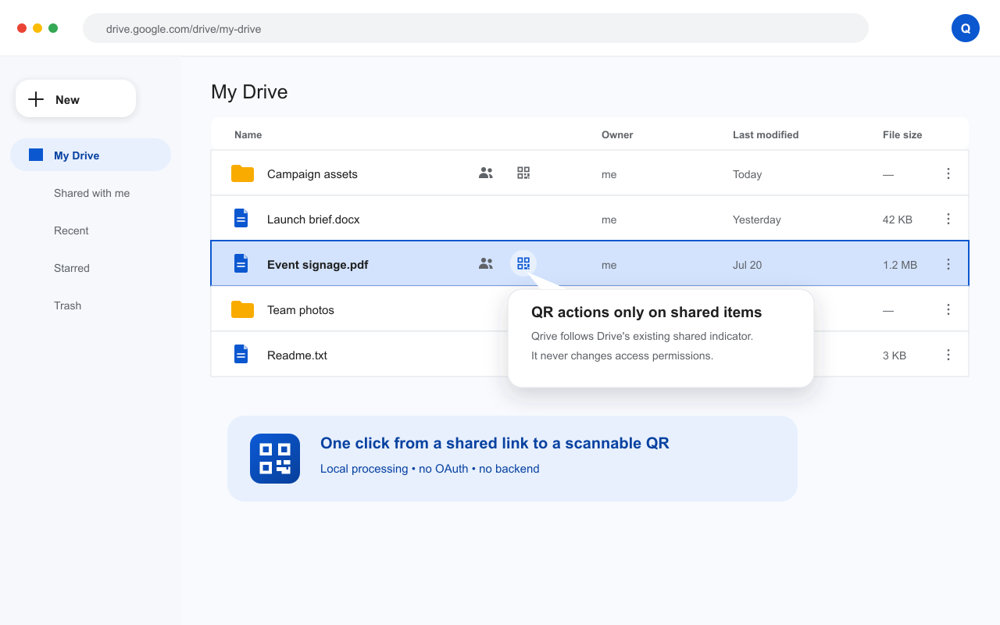
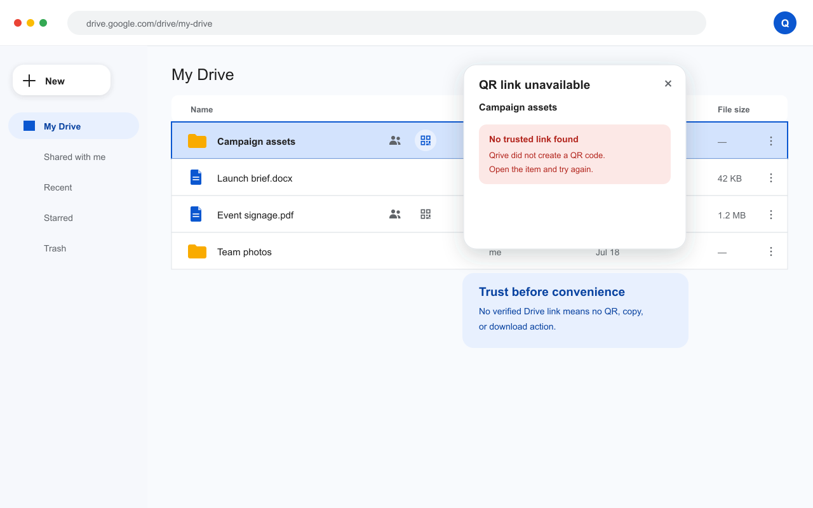

<div align="center">
  
  <h1>Qrive</h1>
  <p><strong>QR Links for Google Drive</strong></p>
  <p>Turn a Drive item that is already shared into a scannable QR code — in one click.</p>
  <p>
    <a href="https://chromewebstore.google.com/detail/qrive-%E2%80%94-qr-links-for-goog/onpipenoogdnnebljkmengnkgilljelm">
      
    </a>
  </p>
  <p>
    <a href="#see-it-in-action">See it in action</a>
    ·
    <a href="#privacy-and-trust">Privacy &amp; trust</a>
    ·
    <a href="#development-setup">Build it yourself</a>
  </p>
  <p>
    <a href="https://github.com/GGULBAE/Qrive/actions/workflows/ci.yml"></a>
    <a href="https://chromewebstore.google.com/detail/qrive-%E2%80%94-qr-links-for-goog/onpipenoogdnnebljkmengnkgilljelm"></a>
    <a href="LICENSE"></a>
    
  </p>
</div>

<p align="center">
  <a href="https://chromewebstore.google.com/detail/qrive-%E2%80%94-qr-links-for-goog/onpipenoogdnnebljkmengnkgilljelm">
    
  </a>
</p>

## A faster path from Drive to QR

Qrive adds a small QR action beside Google Drive's existing shared indicator.
Click it to get the item's QR code, copy its link, or save a PNG — without
opening a sharing dialog or changing who can access the item.

| One click from Drive | Local by design | Permissions stay in control |
| :---: | :---: | :---: |
| The QR action appears beside items Drive already marks as shared. | QR generation happens entirely in your browser. No OAuth, backend, analytics, or remote QR service. | Qrive never makes an item public and never edits its existing Google Drive sharing settings. |

## See it in action

<p align="center">
  
</p>

<p align="center">
  
  
</p>

## How it works

1. Share a file or folder using Google Drive's normal controls.
2. Select the Qrive button beside Drive's existing shared icon.
3. Scan the QR, copy the link, or save it as a PNG.

If Qrive cannot find a trusted Drive URL or stable item ID, it shows a clear
error instead of producing a potentially incorrect QR code.

## Built for everyday Drive use

- Works with shared files, folders, Google Docs, Sheets, Slides, and Forms.
- Handles Google Drive's single-page navigation and virtualized, reused rows.
- Keeps its UI isolated from Drive with Shadow DOM.
- Supports Korean and English labels, keyboard navigation, focus containment,
  Escape, and outside-click dismissal.
- Includes clear copied-link feedback and reduced-motion support.
- Requests no additional Chrome API permissions beyond access to
  `https://drive.google.com/*`.

## Install

[Install Qrive from the Chrome Web Store][chrome-web-store], then open or
reload Google Drive. Qrive appears only beside items that Google Drive already
marks as shared.

> Qrive is an independent open-source project. It is not affiliated with,
> endorsed by, or sponsored by Google.

[chrome-web-store]: https://chromewebstore.google.com/detail/qrive-%E2%80%94-qr-links-for-goog/onpipenoogdnnebljkmengnkgilljelm

## Privacy and trust

The extension runs only on `https://drive.google.com/*` through its declared
content script. It requests no additional Chrome API permissions.
Chrome may still show a site-access warning because the content-script match
allows Qrive to read and update the Google Drive page DOM. Qrive's manifest
does not request access to other sites.

For a row that Google Drive marks as shared, Qrive prefers an existing HTTPS
URL for a Drive file/folder or Google Docs, Sheets, Slides, or Forms item. If no
URL exists, it may build `https://drive.google.com/open?id=...` only from an
explicit row-level `data-drive-id`, `data-item-id`, or `data-id` value that
matches a strict stable-ID format. Qrive does not infer an ID from arbitrary
text. If neither source is trustworthy, the popover explains the problem and
does not create, copy, or save a QR code.

Opening the QR destination is still governed by the item's current Google
Drive sharing policy. A recipient without access will continue to see
Google's access-request or sign-in flow. Qrive never reads or changes the
sharing policy.

## Development setup

Prerequisites:

- Node.js 20 or newer
- Corepack

The repository pins pnpm in `package.json` and commits `pnpm-lock.yaml`.

```powershell
corepack enable
corepack install
pnpm install --frozen-lockfile
pnpm check
```

Useful commands:

```powershell
pnpm dev          # rebuild TypeScript while files change
pnpm typecheck
pnpm lint
pnpm test
pnpm build        # create the unpacked extension in dist/
pnpm package      # create artifacts/qrive-v<version>.zip
pnpm store-assets # regenerate Chrome Web Store screenshots and promo images
```

The `dev` command watches TypeScript. Reload the extension from
`chrome://extensions` after each rebuild. Static manifest, locale, or icon
changes require restarting `pnpm dev` or running `pnpm build`.

## Load the unpacked extension

1. Run `pnpm build`.
2. Open `chrome://extensions`.
3. Enable **Developer mode**.
4. Select **Load unpacked**.
5. Choose this repository's `dist` directory.
6. Open or reload a Google Drive list and look for Qrive's QR icon beside an
   existing shared icon.

For a non-destructive smoke test, use a file or folder that is already shared.
Open the Qrive popover, compare its copied URL with the row URL, scan the QR in
a separate browser profile, and confirm that Google Drive enforces the
pre-existing access policy. Do not change the sharing dialog during this test.

## Architecture

- `src/drive-dom.ts` contains shared-state detection, allowlisted link
  validation, item-name extraction, and row discovery.
- `src/row-controller.ts` owns idempotent button overlays and virtualized-row
  refresh behavior.
- `src/popover.ts` owns the local QR, copy/download actions, positioning, and
  focus behavior.
- `src/content-script.ts` batches SPA mutations into animation-frame scans.
- `tests/` uses DOM fixtures to cover shared-row detection, trusted link
  extraction, duplicate prevention, and row reuse.
- `scripts/` builds, creates icons, and produces a reproducibly ordered release
  archive.

Each injected button and the popover use an open Shadow Root for style
isolation and testability. Buttons are mounted outside Google Drive's managed
row subtree and positioned beside the shared indicator. This prevents Drive's
DOM reconciliation from repeatedly removing and recreating them. Qrive does
not monkey-patch Google Drive code.

## Known DOM dependency

Google Drive does not publish a stable extension API for its file-list DOM.
Qrive therefore depends on accessibility roles, shared-label text, item links,
and a small set of row data attributes currently exposed by the page. Google
can change any of these without notice.

The selectors and accepted English/Korean shared labels are intentionally
conservative. This reduces false QR codes but may cause Qrive to omit a button
after a Drive UI update. When that happens, capture a sanitized DOM fixture
with file names, IDs, and account information removed, add a regression test,
then update `src/drive-dom.ts`.

Qrive currently observes English `Shared`/`Shared with…` and Korean
`공유됨`/`공유된 항목`/`공유 사용자…` indicators. Other Drive UI languages are
not yet supported.

## Privacy

All QR rendering happens inside the browser with a bundled library. Item names
and URLs are used only in the current page to render the popover, copy the URL,
or create the requested PNG. Qrive has no network client, storage, telemetry,
advertising, OAuth flow, or backend. Google Drive itself continues to receive
normal browser requests when a user opens Drive or follows a link.

See the full [Privacy Policy](PRIVACY.md) for the data categories handled
locally, retention, sharing, site access, and Chrome Web Store Limited Use
statement.

## Contributing and security

Contributions are welcome. Read [CONTRIBUTING.md](CONTRIBUTING.md) and the
[Code of Conduct](CODE_OF_CONDUCT.md) before opening a pull request. Report
vulnerabilities privately according to [SECURITY.md](SECURITY.md); never post
real Drive links, item IDs, file names, or account data in a public issue.

## Release and Chrome Web Store deployment

1. Update the version in `package.json` and `manifest.json`.
2. Run `corepack install` and `pnpm install --frozen-lockfile`.
3. Run `pnpm check`.
4. Run `pnpm store-assets` and `pnpm package`.
5. Inspect the generated ZIP and load its uncompressed contents in a clean
   Chrome profile.
6. Upload the ZIP in the Chrome Web Store developer dashboard.
7. Complete the listing and privacy fields from the version-controlled
   [store submission kit](store/README.md), then submit for review.

No publishing credential belongs in this repository.

Qrive is an independent open-source project and is not affiliated with,
endorsed by, or sponsored by Google. Google Drive is a trademark of Google LLC.

## License

[MIT](LICENSE)
